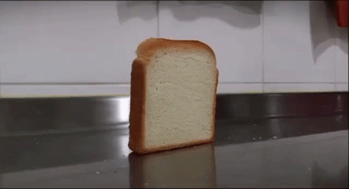

# Engineering_4_Notebook

Click on , located at the top left, for navigation of different assignments.


&nbsp;
## Random Stuff:
### Test Link
 [Link to raspberry-pi temp](raspberry-pi)
### Test Image
  
### Test GIF

&nbsp;


&nbsp;
## Launch Pad Part 1 (Countdown)
#### Assignment: Countdown from 10 seconds to 0 (liftoff). Print that countdown to the serial monitor.

https://user-images.githubusercontent.com/71342159/190177536-60bced6a-d8a5-4760-97a8-236c39c09282.mp4


[Link to Code.](https://github.com/Logan-Martin/Engineering_4_Notebook/blob/main/raspberry-pi/LaunchpadCodeFolder/Launchpad1Code)

#### Reflection:
I felt like I had no idea what I was doing and tried doing everything on the first launch pad assignment. Wiring was kind of an issue, but google exists along with the stuff provided in the assignment so everything was fine. To throw a lesson out there, check out strings and concatenating things. "Countdown: 10" is nicer than "10". 
&nbsp;


&nbsp;
## Launch Pad Part 2 (Lights)
#### Assignment: Blink a red light each second of the countdown, and turn on a green LED to signify liftoff.

https://user-images.githubusercontent.com/71342159/190190369-0d09ca60-f6df-4a7c-9193-2970ff83d496.mp4


[Link to Code.](https://github.com/Logan-Martin/Engineering_4_Notebook/blob/main/raspberry-pi/LaunchpadCodeFolder/Launchpad2Code)

#### Reflection:
Not much to reflect on. Make sure you have a resistor for your LED, remember the long end is positive, use OUTPUT, turn value to true/false.
&nbsp;


&nbsp;
## Launch Pad Part 3 (Button)
#### Assignment: Include a physical button that starts the countdown. 

https://user-images.githubusercontent.com/71342159/190427455-b35110a5-d97b-4436-bd9d-c97473b464cf.mp4


[Link to Code.](https://github.com/Logan-Martin/Engineering_4_Notebook/blob/main/raspberry-pi/LaunchpadCodeFolder/Launchpad3Code)

#### Reflection:
Forgot what lines of code I needed for this to work. A couple minutes later button prints stuff and yeah. There are two ways of connecting a button apparently, do the one that makes the button print "True" because that makes more sense. Use INPUT, not OUTPUT. Make sure you pull up/down resistors, I don't really understand it but it makes it work: 
```
button1 = digitalio.DigitalInOut(board.GP18)
button1.direction = digitalio.Direction.INPUT
button1.pull = digitalio.Pull.DOWN
```
&nbsp;


&nbsp;
## Launch Pad Part 4 (Servo)
#### Assignment: Actuate a 180 degree servo on liftoff to simulate the launch tower disconnecting.

https://user-images.githubusercontent.com/71342159/190658767-93088c80-a5eb-4f8d-89ba-7f146ba9d465.mp4


[Link to Code.](https://github.com/Logan-Martin/Engineering_4_Notebook/blob/main/raspberry-pi/LaunchpadCodeFolder/Launchpad4Code)

#### Reflection:
Make sure you have everything wired up correctly with the servo, pretty easy to follow as there were instructions. Oh, I guess also make sure you grab the correct servo.
&nbsp;


&nbsp;
## Crash Avoidance Part 1 (Accelerometer)
#### Assignment: The module must have an accelerometer that continuously reports x, y, and z acceleration values on the serial monitor.

https://user-images.githubusercontent.com/71342159/191042721-9f2a09b5-b735-4e9e-8864-6b65203d9a9d.mp4


[Link to Code.](https://github.com/Logan-Martin/Engineering_4_Notebook/blob/main/raspberry-pi/Crash%20Avoidance%20Part%201%20Code)

#### Reflection:
Pretty easy to follow, the printing thing was new, using fstring. I added the strings together to make sense of the info given in the prints. Gyro & Acceleration. 
&nbsp;


&nbsp;
## Crash Avoidance Part 2 (Light + Powerboost)
#### Assignment:
1. The module must have an accelerometer that continuously reports x, y, and z acceleration values.
2. The module must have an LED that turns on if the helicopter is tilted to 90 degrees. 
3. The module must be powered by a mobile power source. 

https://user-images.githubusercontent.com/71342159/191521487-4403ba4e-216d-41b9-87df-05f9b2d2ea82.mp4


[Link to Code.](https://github.com/Logan-Martin/Engineering_4_Notebook/blob/main/raspberry-pi/Crash%20Avoidance%20Assignments/Crash%20Avoidance%20Part%202%20Code)

#### Reflection:
Make sure you do CTRL+S to save code, make sure the battery is charged, and that your wiring is all good. I'd say the hardest thing about this for me was just dealing with VS code, well, it was really my fault not VS code' but yeah.
&nbsp;

&nbsp;
## Crash Avoidance Part 3 (OLED Screen)
#### Assignment:
The module must have an onboard screen that prints x, y, and z angular velocity values (rad/s) rounded to 3 decimal places.

https://user-images.githubusercontent.com/71342159/191984762-26e465a1-f648-428b-bccb-aa38c250af5b.mp4


[Link to Code.](https://github.com/Logan-Martin/Engineering_4_Notebook/blob/main/raspberry-pi/Crash%20Avoidance%20Assignments/Crash%20Avoidance%20Part%203%20Code)

#### Reflection:

Making things actually appear on the OLED screen and stay there is annoying. Here's what you need for something basic:
```
splash = displayio.Group() # create the display group
toptitle = "Hello World!"
text_area = label.Label(terminalio.FONT, text=toptitle, color=0xFFFF00, x=5, y=5) # the order of this command is (font, text, text color, and location)
splash.append(text_area) # have this after line above, need it for it to work.
display.show(splash) # send display group to screen, need this.
```
Wiring is also sort of a headache. Make sure to have a reset pin, GP pin, and the correct i2c adress things correct. 

Another code tid-bit is absolute value-ing:
```
abs(stuff here)
```
```
if abs(mpu.acceleration[0]) >= 9.35 and abs(mpu.acceleration[0]) <= 10.35 or abs(mpu.acceleration[1]) >= 9.35 and abs(mpu.acceleration[1]) <= 10.35: # this check values, if they are 90 or -90, then a led will turn on.
        print("Tilted 90 degrees.")
        redLED.value = True
    else:
        redLED.value = False
```
&nbsp;


&nbsp;
## Landing Area Part 1 (Functions)
#### Assignment:
1. The code must ask for the user to input a set of three coordinates in (x,y) format
2. The triangle area must be determined using a function
3. If the user inputs coordinates incorrectly (letters or improper format) the code should return to the input stage, it should not throw an error or exit the script
4. The triangle area must be printed to the screen in this format: “The area of the triangle with vertices (x,y), (x,y), (x,y) is {area} square km.
5. The code must return to the input stage after printing the area, and wait for user input.

https://user-images.githubusercontent.com/71342159/193598210-23c0de68-14c9-42e4-937f-c109e278e643.mp4


[Link to Code.](https://github.com/Logan-Martin/Engineering_4_Notebook/blob/main/raspberry-pi/Landing%20Area%20Assignments/Landing%20Area%20Part%201%20(Functions))

#### Reflection:
Everything was pretty strait-forward with the instructrions and everything, it just took a very long time. A few things:

Messing with variables inside a function, most times, requires the variable to be "global":
```
cords1HaveBeenDefined = False
def userInputCordsFunction1():
    cordsInput1 = input("Please enter the 1st cords in x,y format: ")
    global cords1HaveBeenDefined 
    global x1 
    global y1
```
Try execpt code bit:
```
# this checks if the variables are a "float"/number, if it's not it will tell you to use numbers as input.
try:
 x1 = float(xCord1)
 y1 = float(yCord1)
 print("Done.")
except:
 print("Please use numbers.")
 cords1HaveBeenDefined = False
```
This is how I prompted/checked things. There's a better way to do this, I'm sure, but his is how I did it. **It's inside a while true loop**.:
```
if (cords1HaveBeenDefined == False):
        cords1HaveBeenDefined = True
        userInputCordsFunction1()
    elif (cords1HaveBeenDefined == True):
        if (cords2HaveBeenDefined == False):
            cords2HaveBeenDefined = True
            userInputCordsFunction2()
        elif (cords2HaveBeenDefined == True):
            if (cords3HaveBeenDefined == False):
                cords3HaveBeenDefined = True
                userInputCordsFunction3()
            elif (cords3HaveBeenDefined == True):
                if (haveAllTheCordBeenDefined == False):
                    haveAllTheCordBeenDefined = True
                    print("All cords have been input, yay.")
                    areaBasedOfCords = x1*(y2-y3) + x2*(y3-y1) + x3*(y1-y2)
                    areaBasedOfCords = areaBasedOfCords/2
                    areaBasedOfCords = abs(areaBasedOfCords)
                    print("Based on inputs, area is: " + str(areaBasedOfCords) + " sq km")
```
&nbsp;


&nbsp;
## Landing Area Part 2 (Plotting)
#### Assignment:
An onboard OLED screen must plot each triangle on a graph relative to the base location.

https://user-images.githubusercontent.com/71342159/194084231-0ea36b07-5e8c-4879-b488-e89b02677748.mp4


[Link to Code.](https://github.com/Logan-Martin/Engineering_4_Notebook/blob/main/raspberry-pi/Landing%20Area%20Assignments/Landing%20Area%20P2%20%20(Plotting))

#### Reflection:
To make code actually go to quads, add 64 to the X values of the triangle. For Y, do 32 - y1, 32 - y2, ect. That took a bit to find out, [this was a helpful source.](https://makeabilitylab.github.io/physcomp/advancedio/oled.html) Pretty much the same code as part 1, but with a bunch of random trail and error.

&nbsp;


&nbsp;
## Morse Code Part 1 (Translation)
#### Assignment:
1.) Your script must accept text input by the user
2.) If the user types “-q”, your script must exit
3.) If the user types anything else, your script must translate the text to morse code dots and dashes, and print those to the monitor
4.) The printed text must use a space to show breaks between letters, and a slash to show breaks between words

https://user-images.githubusercontent.com/71342159/194573859-db974235-f517-4c4a-b879-2b6c45d17bc6.mp4

No wiring required.

[Link to Code.](https://github.com/Logan-Martin/Engineering_4_Notebook/blob/main/raspberry-pi/Morse%20Code%20Assignments/Morse%20Code%20P1)

#### Reflection:
I've broken up the work into different functions to make it easier, I think, to understand. Dictionary was already given so I didn't exactly need to do much on that end. Prompt User -> check if that message is "-q" -> if it's not, go to the function that translates -> Break up message character by character using "for i, v". -> add all the strings together. Boom.
 
&nbsp;


